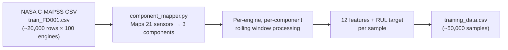
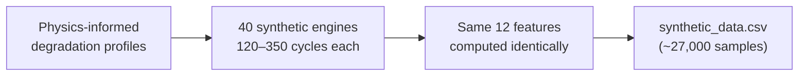
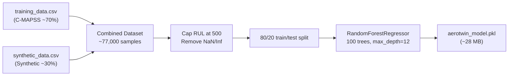
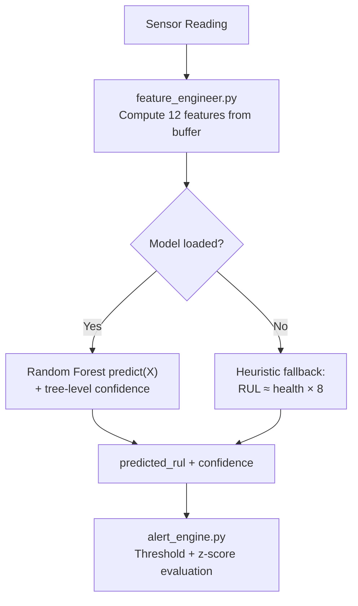
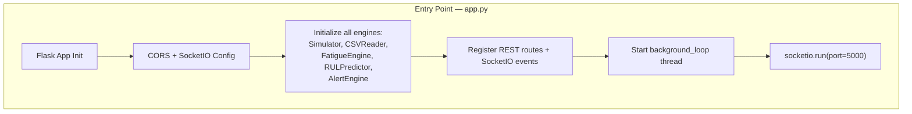
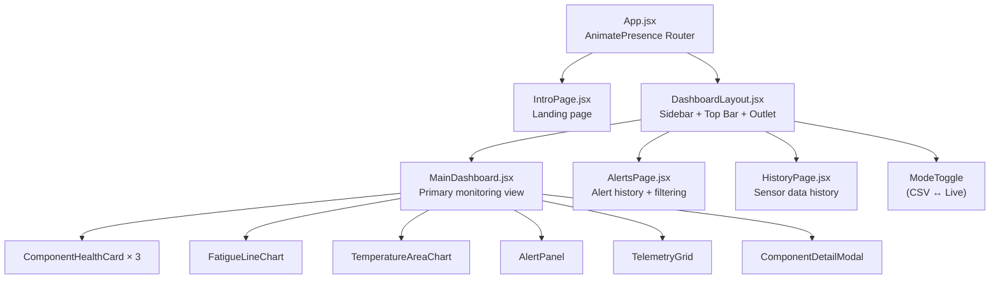
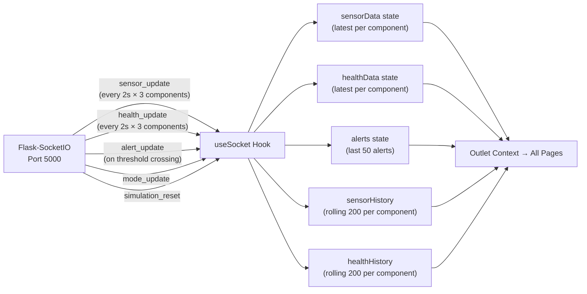

# AeroTwin — Complete Project Deep Analysis

> A real-time Digital Twin for predictive aircraft engine health monitoring using NASA C-MAPSS data, Random Forest ML, Flask-SocketIO backend, and React dashboard.

---

## 🧠 1. ML Pipeline — How It Works End-to-End

The ML pipeline is a **3-stage offline training process** that produces a `.pkl` model, which is then used for **real-time inference** on the server.

### Stage 1 — Data Preprocessing ([preprocess_cmapss.py](file:///c:/MERN%20STACK/9%20-%20COURSE%20PROJECTS/AERO-TWIN/ml/preprocess_cmapss.py))



**What it does:**
1. Reads raw NASA C-MAPSS `train_FD001.csv` — each row = 1 flight cycle of 1 engine
2. For each of the 100 engines, processes all cycles **per component** (turbine_blade, compressor, bearing)
3. Uses [component_mapper.py](file:///c:/MERN%20STACK/9%20-%20COURSE%20PROJECTS/AERO-TWIN/server/component_mapper.py) to split 21 C-MAPSS sensors into 3 component groups:

| Component | Sensors Used | Temp Source | Vibration Proxy | RPM Proxy |
|---|---|---|---|---|
| **Turbine Blade** | s3, s4, s20 | s3 (HPC outlet temp ~1585°C) | s20 (BPR ~23.4) | s4 (LPT outlet temp) |
| **Compressor** | s2, s7, s11, s17 | s2 (fan inlet ~642°C) | s11 (fan speed ~47.3) | s17 (bleed enthalpy ~8135) |
| **Bearing** | s8, s9, s13, s14 | s8 (Ps30 ~2388) | s13 (corrected fan speed) | s14 (corrected core speed ~8130) |

4. Accumulates **fatigue** for each component using the physics formula (see below)
5. Requires ≥10 readings before computing features (for rolling window stats)
6. Outputs `training_data.csv` with 12 features + RUL target

### Stage 2 — Synthetic Data Generation ([generate_synthetic.py](file:///c:/MERN%20STACK/9%20-%20COURSE%20PROJECTS/AERO-TWIN/ml/generate_synthetic.py))



**What it does:**
1. Generates **40 synthetic engine trajectories** with random degradation rates (`rate_multiplier = 0.7–1.3`)
2. Each trajectory runs 120–350 cycles (randomly sampled)
3. Uses the **exact same degradation formulas** as the live simulator:
   - **Temperature**: `base + cycle × rate × multiplier + Gaussian noise`
   - **Vibration**: linear increase + **exponential component** after threshold (e.g., 100 hours for turbine blade)
   - **RPM**: linear drift at -0.02%/hour + noise
4. Computes the same 12 features, producing `synthetic_data.csv`

### Stage 3 — Model Training ([train_model.py](file:///c:/MERN%20STACK/9%20-%20COURSE%20PROJECTS/AERO-TWIN/ml/train_model.py))



**Key training decisions:**
- **RUL capped at 500**: Common C-MAPSS practice — early cycles have very high RUL which is effectively "healthy", so capping prevents the model from spending capacity on the uninteresting part of the curve
- **80/20 split** with `random_state=42` for reproducibility
- **RandomForestRegressor** with 100 trees, `max_depth=12`, `min_samples_split=5`
- `n_jobs=-1` for parallel training across all CPU cores
- Achieves R² ~0.91–0.94, MAE ~12–18 flight hours

---

## 🔍 How Detection Works — The 12 Features

The detection system is built on **12 carefully engineered features** computed from a rolling window of the last 10–20 sensor readings. Here's how each contributes to detection:

| # | Feature | What It Detects | How |
|---|---|---|---|
| F1 | `rolling_mean_vibration_10` | **Sustained vibration increase** | Mean of last 10 vibration readings — elevated mean = progressive wear |
| F2 | `rolling_std_vibration_10` | **Vibration instability** | High std = erratic behavior, bearing failure precursor |
| F3 | `vibration_slope_20` | **Vibration acceleration** | Linear regression slope over 20 ticks — positive slope = worsening trend |
| F4 | `rolling_mean_temp_10` | **Thermal overload** | Sustained high temp = blade thermal fatigue, compressor fouling |
| F5 | `temp_rise_rate` | **Thermal runaway** | °C per flight hour — rapid rise = imminent failure mode |
| F6 | `rolling_std_temp_10` | **Thermal instability** | Erratic temperature = unstable combustion or cooling failure |
| F7 | `rpm_drift` | **Power degradation** | Deviation from baseline RPM — negative drift = efficiency loss |
| F8 | `vib_temp_correlation` | **Coupled failure mode** | High correlation = mechanical fault causing thermal effect (or vice versa) |
| F9 | `cumulative_fatigue` | **Total damage accumulation** | Physics-based integral of all stress factors — monotonically increasing |
| F10 | `health_score` | **Overall component health** | `100 - cumulative_fatigue` — provides absolute health context |
| F11 | `flight_hour_normalised` | **Age factor** | Normalized time (0–1) — older components have higher failure probability |
| F12 | `max_z_score_10` | **Anomaly spike detection** | Max z-score of recent vibration + temp — z > 3.5 = statistical anomaly |

### The Fatigue Formula ([fatigue_engine.py](file:///c:/MERN%20STACK/9%20-%20COURSE%20PROJECTS/AERO-TWIN/server/fatigue_engine.py))

This is the physics-informed core of the detection system:

```
fatigue_delta = (T_factor^1.4 × V_factor^1.8 × RPM_factor^1.2) × sensitivity

Where:
  T_factor   = current_temperature / baseline_temperature    (thermal stress)
  V_factor   = current_vibration / baseline_vibration        (mechanical stress)
  RPM_factor = current_rpm / rated_rpm                       (rotational stress)

  Component sensitivity weights:
    Turbine Blade = 1.4   (highest — thermal stress dominant)
    Bearing       = 1.1   (medium — vibration-dominant wear)
    Compressor    = 0.9   (lowest — pressure-cycle fatigue)

  Scaling: fatigue_delta = max(0, (raw - baseline × 0.8)) × 0.5
  Accumulation: cumulative_fatigue += fatigue_delta (each tick)
  Health: health_score = max(0, 100 − cumulative_fatigue)
```

> [!IMPORTANT]
> The **exponent weighting** is key: vibration has the highest power (1.8), making it the most sensitive indicator. Temperature is next (1.4), and RPM lowest (1.2). This mirrors real turbofan failure physics where vibration anomalies are the earliest and most reliable degradation signal.

### The Alert System ([alert_engine.py](file:///c:/MERN%20STACK/9%20-%20COURSE%20PROJECTS/AERO-TWIN/server/alert_engine.py))

Detection happens at two levels:

**1. RUL Threshold Detection:**
| Predicted RUL | Severity | Action |
|---|---|---|
| > 500 hrs | 🟢 GREEN | No action |
| 100–500 hrs | 🟡 AMBER | Schedule inspection within 2 weeks |
| 50–100 hrs | 🔴 RED | Priority inspection within 48 hours |
| ≤ 50 hrs | 🚨 CRITICAL | Ground aircraft immediately |

**2. Z-Score Anomaly Detection:**
- Maintains a **rolling window of 20 readings** per component for vibration and temperature
- Computes real-time z-scores against the rolling window
- **z-score > 3.5** triggers an ANOMALY override → immediately CRITICAL
- This catches **sudden fault events** (e.g., bird strike, foreign object damage) that the RUL trend model would miss

### Real-Time Inference Flow ([ml_model.py](file:///c:/MERN%20STACK/9%20-%20COURSE%20PROJECTS/AERO-TWIN/server/ml_model.py))



**Confidence calculation** is clever: it uses the **coefficient of variation (CV)** across all 100 individual tree predictions. If trees agree (low CV), confidence is high. If trees disagree (high CV), confidence drops. This is a natural ensemble uncertainty measure.

**Fallback heuristic**: If the `.pkl` file isn't available, a simple `RUL ≈ health_score × 8` linear mapping is used, adjusted by vibration slope and flight hours. This ensures the system always works, even without the ML model.

---

## ⚙️ 2. Backend Architecture

### Overview

The backend is a **Flask + Flask-SocketIO** application with a **PostgreSQL** database, running a **background processing loop** that generates/reads data and pushes real-time updates via WebSocket.



### The Processing Tick — Heart of the System ([app.py:126-253](file:///c:/MERN%20STACK/9%20-%20COURSE%20PROJECTS/AERO-TWIN/server/app.py#L126-L253))

Every **2 seconds**, the `processing_tick()` function runs this complete pipeline:

| Step | What Happens | Module |
|---|---|---|
| 1 | Generate 3 sensor readings (1 per component) | [simulator.py](file:///c:/MERN%20STACK/9%20-%20COURSE%20PROJECTS/AERO-TWIN/server/simulator.py) or [csv_reader.py](file:///c:/MERN%20STACK/9%20-%20COURSE%20PROJECTS/AERO-TWIN/server/csv_reader.py) |
| 2 | Save raw readings to PostgreSQL `sensor_readings` table | [db_writer.py](file:///c:/MERN%20STACK/9%20-%20COURSE%20PROJECTS/AERO-TWIN/server/db_writer.py) |
| 3 | Compute fatigue delta + update health scores | [fatigue_engine.py](file:///c:/MERN%20STACK/9%20-%20COURSE%20PROJECTS/AERO-TWIN/server/fatigue_engine.py) |
| 4 | Buffer readings (last 30) + compute 12 ML features | [feature_engineer.py](file:///c:/MERN%20STACK/9%20-%20COURSE%20PROJECTS/AERO-TWIN/server/feature_engineer.py) |
| 5 | Run Random Forest prediction → RUL + confidence | [ml_model.py](file:///c:/MERN%20STACK/9%20-%20COURSE%20PROJECTS/AERO-TWIN/server/ml_model.py) |
| 6 | Evaluate alert thresholds + z-score anomaly detection | [alert_engine.py](file:///c:/MERN%20STACK/9%20-%20COURSE%20PROJECTS/AERO-TWIN/server/alert_engine.py) |
| 7 | Save health snapshot to PostgreSQL `health_snapshots` table | [db_writer.py](file:///c:/MERN%20STACK/9%20-%20COURSE%20PROJECTS/AERO-TWIN/server/db_writer.py) |
| 8 | Save alert to `maintenance_log` (if threshold crossed) | [db_writer.py](file:///c:/MERN%20STACK/9%20-%20COURSE%20PROJECTS/AERO-TWIN/server/db_writer.py) |
| 9 | Emit `sensor_update`, `health_update`, `alert_update` via Socket.IO | [socketio_server.py](file:///c:/MERN%20STACK/9%20-%20COURSE%20PROJECTS/AERO-TWIN/server/socketio_server.py) |

### Two Data Modes

**Mode A — CSV Replay** ([csv_reader.py](file:///c:/MERN%20STACK/9%20-%20COURSE%20PROJECTS/AERO-TWIN/server/csv_reader.py)):
- Loads entire NASA CSV into memory on startup
- Returns 1 row every tick, mapped through `component_mapper`
- Auto-loops when reaching the end
- Tracks engine transitions for multi-engine datasets

**Mode B — Live Simulation** ([simulator.py](file:///c:/MERN%20STACK/9%20-%20COURSE%20PROJECTS/AERO-TWIN/server/simulator.py)):
- Physics-informed synthetic generator with per-component degradation profiles
- Exponential vibration growth after threshold (mimics real fatigue curves)
- Supports **anomaly injection**: vibration spike (2.5–4×), thermal surge (+50–150°C), RPM drop (85–92%)
- Anomalies persist for 10 ticks then auto-clear

### REST API ([routes.py](file:///c:/MERN%20STACK/9%20-%20COURSE%20PROJECTS/AERO-TWIN/server/routes.py))

| Endpoint | Method | Purpose |
|---|---|---|
| `/api/health` | GET | Current health/RUL/severity for all 3 components |
| `/api/history` | GET | Sensor readings from PostgreSQL (paginated) |
| `/api/rul` | GET | Latest ML predictions + confidence per component |
| `/api/alerts` | GET | Maintenance log (most recent first, max 200) |
| `/api/anomaly` | POST | Inject fault (live mode only) |
| `/api/reset` | POST | Reset all engines to baseline |
| `/api/mode` | POST | Switch between CSV/Live modes |

### Database ([db.py](file:///c:/MERN%20STACK/9%20-%20COURSE%20PROJECTS/AERO-TWIN/server/db.py) + [db_writer.py](file:///c:/MERN%20STACK/9%20-%20COURSE%20PROJECTS/AERO-TWIN/server/db_writer.py))

- **PostgreSQL 16** with psycopg2 ThreadedConnectionPool (2–10 connections)
- **3 tables**: `sensor_readings`, `health_snapshots`, `maintenance_log`
- Auto-creates tables on startup (no migration tool needed)
- Indexed by `(component_id, session_id, flight_hour)` and `created_at DESC`
- Each session gets a UUID for traceability

---

## 🖥️ 3. Frontend Architecture

### Tech Stack
- **React 18** + Vite (dev server on port 5173)
- **TailwindCSS** with custom design system (aero-* color tokens)
- **Framer Motion** for page transitions and micro-animations
- **Recharts** for live data visualization
- **Socket.IO Client** for real-time data streaming
- **react-hot-toast** for alert notifications
- **react-icons** for iconography

### Component Tree



### Real-Time Data Flow ([useSocket.js](file:///c:/MERN%20STACK/9%20-%20COURSE%20PROJECTS/AERO-TWIN/client/src/hooks/useSocket.js))

The `useSocket` custom hook is the central nervous system of the frontend:



**Key design decisions:**
- Uses **HTTP long-polling** transport (not WebSocket) — more reliable behind proxies
- Rolling history buffers capped at 200 entries (prevents memory leaks)
- Alert buffer capped at 50 entries
- Auto-toast for CRITICAL/RED alerts with 8-second duration
- All state is centralized in the hook and passed via React Router's `Outlet context`

### Pages

1. **[IntroPage.jsx](file:///c:/MERN%20STACK/9%20-%20COURSE%20PROJECTS/AERO-TWIN/client/src/pages/IntroPage.jsx)** — Animated landing page with project info and "Enter Dashboard" CTA
2. **[MainDashboard.jsx](file:///c:/MERN%20STACK/9%20-%20COURSE%20PROJECTS/AERO-TWIN/client/src/pages/MainDashboard.jsx)** — 3-column layout: health cards | charts | alerts + telemetry grid + component detail modal
3. **[AlertsPage.jsx](file:///c:/MERN%20STACK/9%20-%20COURSE%20PROJECTS/AERO-TWIN/client/src/pages/AlertsPage.jsx)** — Full alert history with severity filtering
4. **[HistoryPage.jsx](file:///c:/MERN%20STACK/9%20-%20COURSE%20PROJECTS/AERO-TWIN/client/src/pages/HistoryPage.jsx)** — Historical sensor data with component filtering

### Key Components

| Component | Purpose |
|---|---|
| [ComponentHealthCard](file:///c:/MERN%20STACK/9%20-%20COURSE%20PROJECTS/AERO-TWIN/client/src/components/ComponentHealthCard.jsx) | Shows health %, RUL, severity badge per component — clickable for detail modal |
| [FatigueLineChart](file:///c:/MERN%20STACK/9%20-%20COURSE%20PROJECTS/AERO-TWIN/client/src/components/FatigueLineChart.jsx) | Recharts line chart showing fatigue accumulation over time for all 3 components |
| [TemperatureAreaChart](file:///c:/MERN%20STACK/9%20-%20COURSE%20PROJECTS/AERO-TWIN/client/src/components/TemperatureAreaChart.jsx) | Recharts area chart showing temperature trends |
| [AlertPanel](file:///c:/MERN%20STACK/9%20-%20COURSE%20PROJECTS/AERO-TWIN/client/src/components/AlertPanel.jsx) | Live alert feed with severity color-coding and animations |
| [TelemetryGrid](file:///c:/MERN%20STACK/9%20-%20COURSE%20PROJECTS/AERO-TWIN/client/src/components/TelemetryGrid.jsx) | Raw sensor values display grid for all components |
| [ComponentDetailModal](file:///c:/MERN%20STACK/9%20-%20COURSE%20PROJECTS/AERO-TWIN/client/src/components/ComponentDetailModal.jsx) | Deep-dive modal with per-component charts and raw data |
| [ModeToggle](file:///c:/MERN%20STACK/9%20-%20COURSE%20PROJECTS/AERO-TWIN/client/src/components/ModeToggle.jsx) | CSV/Live toggle switch |

---

## 🚀 4. What Can Make This Project More Powerful

### 🔬 ML Pipeline Improvements

#### 4.1 — Upgrade to LSTM / Transformer Model
> **Impact: 🔥🔥🔥 High**

Random Forest is solid for tabular data, but RUL prediction is fundamentally a **time-series problem**. An LSTM or Transformer model could:
- Learn temporal dependencies directly from raw sensor sequences (no manual feature engineering)
- Capture non-linear degradation patterns the forest misses
- Provide probabilistic outputs (predict a distribution, not a point estimate)

```python
# Example: PyTorch LSTM for RUL
class RULPredictor(nn.Module):
    def __init__(self, input_dim=12, hidden_dim=64, num_layers=2):
        super().__init__()
        self.lstm = nn.LSTM(input_dim, hidden_dim, num_layers, batch_first=True)
        self.fc = nn.Linear(hidden_dim, 1)
    
    def forward(self, x):  # x: (batch, seq_len, features)
        _, (h_n, _) = self.lstm(x)
        return self.fc(h_n[-1])
```

#### 4.2 — Use All 4 C-MAPSS Sub-Datasets
> **Impact: 🔥🔥 Medium**

Currently only `train_FD001.csv` is used. Adding FD002, FD003, FD004 would:
- Increase training data by **4×** (100 → 708 engines)
- Add multi-fault mode coverage (FD003/FD004 have both HPC + Fan degradation)
- Add multi-operating-condition coverage (FD002/FD004 have 6 operating conditions)

#### 4.3 — Add Bayesian Uncertainty Quantification
> **Impact: 🔥🔥 Medium**

Replace the CV-based confidence with proper uncertainty:
- **MC Dropout**: Run inference multiple times with dropout, measure spread
- **Quantile Regression**: Predict 10th, 50th, 90th percentile RUL simultaneously
- Display confidence intervals on the dashboard instead of a single number

#### 4.4 — Implement Online Learning / Model Drift Detection
> **Impact: 🔥🔥🔥 High**

The model is static (trained once, deployed forever). Add:
- **Concept drift detection**: Monitor prediction error distribution over time
- **Incremental retraining**: Periodically retrain on recent data
- **A/B model comparison**: Run two models in parallel, compare accuracy

#### 4.5 — Add Explainability (SHAP / LIME)
> **Impact: 🔥🔥 Medium**

Add per-prediction explanations:
```python
import shap
explainer = shap.TreeExplainer(model)
shap_values = explainer.shap_values(X_sample)
# "RUL dropped because vibration_slope_20 increased by 40%"
```
Display on the dashboard: *"Why is this component RED?"* → feature contribution waterfall chart.

---

### ⚙️ Backend Improvements

#### 4.6 — Add Authentication & Multi-User Support
> **Impact: 🔥🔥 Medium**

Currently no auth. Add:
- JWT-based authentication
- Role-based access (admin can inject anomalies, viewer can only observe)
- Multi-session management (different users monitoring different engines)

#### 4.7 — Add WebSocket Transport (Currently Only Polling)
> **Impact: 🔥 Low-Medium**

[useSocket.js](file:///c:/MERN%20STACK/9%20-%20COURSE%20PROJECTS/AERO-TWIN/client/src/hooks/useSocket.js#L33-L38) is configured with `transports: ['polling']` only. Enabling WebSocket transport would reduce latency from ~200ms to ~20ms:
```javascript
const socket = io(SOCKET_URL, {
    transports: ['websocket', 'polling'],  // Try WebSocket first
    ...
});
```

#### 4.8 — Add Data Retention / Archival Policy
> **Impact: 🔥🔥 Medium**

The `sensor_readings` table grows indefinitely (~3 rows per tick × every 2 seconds = ~130,000 rows/day). Add:
- Automatic data partitioning by date (PostgreSQL native partitioning)
- Retention policy: archive data older than 7 days to cold storage
- TimescaleDB extension for optimized time-series queries

#### 4.9 — Add Health Check Endpoint
> **Impact: 🔥 Low**

Add `GET /api/status` that reports:
- Database connectivity
- ML model status
- Simulation state
- WebSocket connections count
- Memory usage

#### 4.10 — Replace Synchronous DB Writes with Async Queue
> **Impact: 🔥🔥 Medium**

Currently each tick does **5 synchronous DB writes** (3 sensor readings + 1 health snapshot + optional alert). Under load, this blocks the processing loop. Use:
- Redis or RabbitMQ as write buffer
- Background worker for batch DB inserts
- Or use `psycopg2.extras.execute_values()` for bulk inserts

---

### 🖥️ Frontend Improvements

#### 4.11 — Add a 3D Engine Visualization (Three.js)
> **Impact: 🔥🔥🔥 High**

The README mentions Three.js and `EngineModel.jsx`, but the current frontend doesn't have it. Adding a 3D turbofan engine model with:
- Color-coded components (green → red based on health)
- Click-to-inspect individual parts
- Animated rotation and zoom
- Heat map overlay showing temperature distribution

#### 4.12 — Add Predictive Charts (RUL Projection)
> **Impact: 🔥🔥 Medium**

Currently charts show historical data. Add:
- **RUL projection curve**: Show predicted future trajectory with confidence bands
- **"What-if" scenarios**: Simulate what happens if current degradation rate continues
- **Comparison overlay**: Show current degradation vs. baseline healthy engine

#### 4.13 — Add Dark/Light Theme Toggle
> **Impact: 🔥 Low**

Currently hardcoded to dark theme. Add a toggle — especially useful for print/export scenarios.

#### 4.14 — Add PDF/CSV Export
> **Impact: 🔥🔥 Medium**

Allow users to export:
- Current health report as PDF
- Historical sensor data as CSV
- Alert log as CSV
- Charts as PNG images

#### 4.15 — Add Mobile Responsiveness
> **Impact: 🔥🔥 Medium**

The current layout uses fixed sidebar widths that don't work well on mobile. Add responsive breakpoints and a hamburger menu for smaller screens.

---

### 🏗️ Architecture Improvements

#### 4.16 — Add Docker Compose for Full Stack
> **Impact: 🔥🔥 Medium**

The current `docker-compose.yml` only has PostgreSQL. Extend to include:
```yaml
services:
  postgres:
    image: postgres:16
  backend:
    build: ./server
    depends_on: [postgres]
  frontend:
    build: ./client
    depends_on: [backend]
  redis:  # For async writes
    image: redis:7
```

#### 4.17 — Add CI/CD Pipeline
> **Impact: 🔥🔥 Medium**

GitHub Actions workflow for:
- Python linting + unit tests
- ML model validation (assert MAE < threshold)
- Frontend build + Lighthouse audit
- Docker image build + push

#### 4.18 — Add Unit Tests
> **Impact: 🔥🔥🔥 High**

Currently **zero test coverage**. Priority test areas:
- `fatigue_engine.py`: Verify formula produces expected values
- `feature_engineer.py`: Verify features match training pipeline
- `alert_engine.py`: Verify threshold logic
- `component_mapper.py`: Verify sensor mapping
- `ml_model.py`: Verify fallback heuristic works

#### 4.19 — Add API Rate Limiting
> **Impact: 🔥 Low**

Use Flask-Limiter to prevent abuse:
```python
from flask_limiter import Limiter
limiter = Limiter(app, key_func=get_remote_address)

@api.route('/api/anomaly')
@limiter.limit("5 per minute")
def inject_anomaly():
    ...
```

---

### 🌟 Ambitious New Features

#### 4.20 — Multi-Engine Fleet View
> **Impact: 🔥🔥🔥 High**

Currently monitors 1 engine. Expand to a fleet of 10+ engines:
- Fleet health dashboard with grid of engine statuses
- Comparative analytics (which engines are degrading fastest?)
- Fleet-wide alerting (e.g., "3 engines in AMBER simultaneously")

#### 4.21 — Maintenance Cost Optimizer
> **Impact: 🔥🔥🔥 High**

Use the RUL predictions to optimize maintenance scheduling:
- Cost model: scheduled inspection ($X) vs. unplanned AOG ($150K/day)
- Optimize maintenance windows across fleet
- Gantt chart of planned maintenance

#### 4.22 — Edge AI Deployment (NVIDIA Jetson)
> **Impact: 🔥🔥🔥 High**

Convert the ML model to run on edge hardware:
- Export Random Forest to ONNX or TensorRT
- Deploy on Jetson Nano with real sensors
- Local inference with cloud sync for dashboards

#### 4.23 — Natural Language Querying (LLM Integration)
> **Impact: 🔥🔥 Medium**

Add a chat interface:
- *"What's the health status of the bearing?"*
- *"When was the last CRITICAL alert?"*
- *"Show me vibration trends for the last 100 flight hours"*
- Use an LLM to translate natural language to API calls

#### 4.24 — Notification System (Email/SMS/Slack)
> **Impact: 🔥🔥 Medium**

Push alerts beyond the dashboard:
- Email notifications for RED/CRITICAL alerts
- Slack/Teams integration for engineering channels
- SMS alerts for on-call maintenance crews
- Configurable notification preferences per severity

#### 4.25 — Digital Twin Synchronization Protocol
> **Impact: 🔥🔥🔥 High**

Implement DTDL (Digital Twins Definition Language) or Azure Digital Twins API compatibility:
- Standardized twin model definition
- Industry-compatible data exchange format
- Integration with enterprise PLM (Product Lifecycle Management) systems

---

## Summary

| Area | Current State | Improvement Potential |
|---|---|---|
| **ML Model** | Random Forest, 12 features, R²~0.93 | LSTM/Transformer, all C-MAPSS datasets, SHAP explainability |
| **Backend** | Flask + SocketIO, PostgreSQL, 2s tick rate | Async writes, auth, multi-engine, rate limiting |
| **Frontend** | React + Tailwind, real-time charts, alerts | 3D engine viz, RUL projection, exports, mobile |
| **Architecture** | Single server, no tests, partial Docker | Full Docker, CI/CD, unit tests, edge deployment |
| **Features** | Single engine monitoring, anomaly injection | Fleet management, cost optimizer, LLM chat, notifications |

> [!TIP]
> **Quick wins to implement first**: Unit tests (4.18), WebSocket transport (4.7), Use all C-MAPSS datasets (4.2), SHAP explainability (4.5), and PDF export (4.14). These add significant value with relatively low effort.
