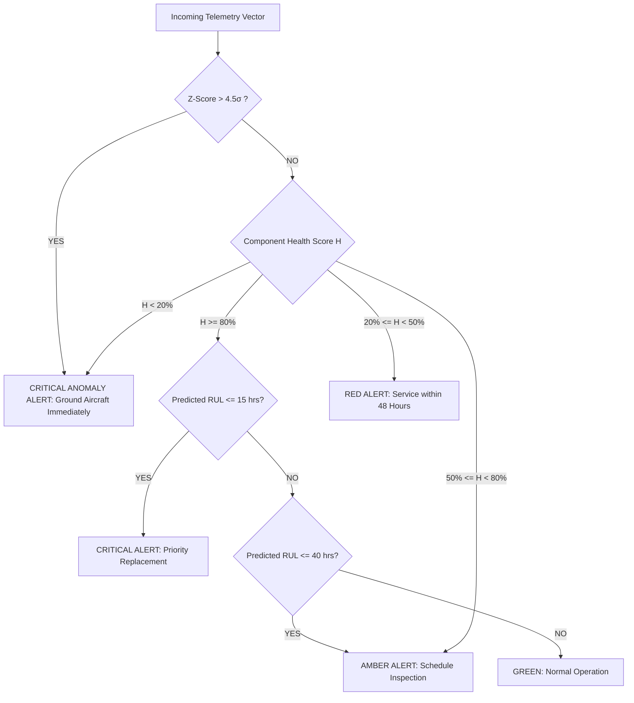

# AeroTwin: A Hybrid Physics-Informed and Data-Driven Digital Twin Framework for Aircraft Turbofan Engine Prognostics and Health Management

---

## 1. Abstract & Executive Summary

**AeroTwin** is a real-time Cyber-Physical Digital Twin platform designed for Predictive Maintenance (PdM) and Prognostics and Health Management (PHM) of commercial aircraft gas turbine engines. The system integrates:
1. **Physics-Informed Damage Mechanics**: Modeling non-linear cumulative fatigue and thermo-mechanical stress based on generalized Palmgren-Miner damage accumulation laws.
2. **Machine Learning Prognostics**: A bagged Random Forest ensemble with SHAP (Shapley Additive Explanations) interpretability that predicts Remaining Useful Life (RUL) in operational flight hours.
3. **Statistical Anomaly Detection**: Dual-channel rolling Z-score surveillance with dynamically conditioned noise floors capable of detecting step-change structural anomalies (e.g., bird strikes, blade detachment, thermal runaway) within a sub-2-second latency window.
4. **Interactive 3D Spatial Visualization**: Real-time bi-directional telemetry binding engine sensory metrics to an interactive Three.js 3D model, highlighting subsystem stress localization across **Turbine Blades**, **High-Pressure Compressors**, and **Shaft Bearings**.

---

## 2. Digital Twin System Architecture

The architecture conforms to the 5-layer Cyber-Physical Systems (CPS) standard for Digital Twins:

```
┌─────────────────────────────────────────────────────────────────────────┐
│              LAYER 5: PRESENTATION & DECISION SUPPORT                    │
│   • 3D Interactive Turbine Visualization (Three.js / React Fiber)       │
│   • Real-Time Subsystem Stress Gauges & Telemetry Charts (Chart.js)     │
│   • Explainable AI (XAI) Feature Importance Inspector (SHAP)            │
└────────────────────────────────────▲────────────────────────────────────┘
                                     │ WebSocket / REST API (Flask-SocketIO)
┌────────────────────────────────────┴────────────────────────────────────┐
│              LAYER 4: MACHINE LEARNING & PROGNOSTICS                     │
│   • 12-Dimensional Feature Extraction Vector                            │
│   • Random Forest Regressor Ensemble (B = 100 Estimators, Depth = 12)   │
│   • Predictive Uncertainty Metric (Inter-Tree Coefficient of Variation) │
│   • 5-Fold GroupKFold Cross-Validation (Engine-Independent Partitioning)│
└────────────────────────────────────▲────────────────────────────────────┘
                                     │
┌────────────────────────────────────┴────────────────────────────────────┐
│              LAYER 3: ANALYTICAL & PHYSICS MODEL LAYER                  │
│   • Multi-Factor Degradation Engine (Thermal, Vibrational, RPM Ratios)  │
│   • Modified Palmgren-Miner Cumulative Fatigue Law                      │
│   • Health State Score Metric: H(t) = max(0, 100 - Cumulative_Fatigue)  │
│   • Statistical Rolling Z-Score Shock Detector (> 4.5σ Threshold)       │
└────────────────────────────────────▲────────────────────────────────────┘
                                     │
┌────────────────────────────────────┴────────────────────────────────────┐
│              LAYER 2: DATA INGESTION & SENSOR MAPPING                   │
│   • Dual Ingestion Engine: Mode A (C-MAPSS CSV Playback) / Mode B (Live)│
│   • 21-Sensor C-MAPSS Dimension Reduction to 3 Critical Subsystems      │
│   • PostgreSQL High-Throughput Batch Persistence Pool (psycopg2)        │
└────────────────────────────────────▲────────────────────────────────────┘
                                     │
┌────────────────────────────────────┴────────────────────────────────────┐
│              LAYER 1: PHYSICAL / SIMULATED ASSET LAYER                  │
│   • NASA C-MAPSS Run-to-Failure Benchmark (FD001, FD002, FD003, FD004) │
│   • Physics-Calibrated Synthetic Engine Trajectories (Stochastic Wear)  │
└─────────────────────────────────────────────────────────────────────────┘
```

---

## 3. Data Foundation & Domain-Specific Subsystem Mapping

High-bypass turbofan engines contain thousands of components. In accordance with aerospace reliability engineering standards, failure modes are concentrated into three primary rotating assemblies:

### 3.1. The NASA C-MAPSS Dataset
The benchmark dataset used is NASA's **Commercial Modular Aero-Propulsion System Simulation (C-MAPSS)**. It simulates a 90,000 lb thrust class engine under diverse operational regimes and fault scenarios:
- **FD001**: Sea level, single fault mode (High-Pressure Compressor degradation).
- **FD002**: 6 operating conditions, single fault mode (HPC degradation).
- **FD003**: Sea level, two fault modes (HPC degradation + Fan/Turbine degradation).
- **FD004**: 6 operating conditions, two fault modes (HPC degradation + Fan/Turbine degradation).

### 3.2. Sensor Reduction Matrix
From the 21 C-MAPSS sensors, 7 near-zero variance channels ($s_1, s_5, s_6, s_{10}, s_{16}, s_{18}, s_{19}$) are eliminated during preprocessing. The remaining informative channels are mapped onto three physical subsystems:

| Subsystem Component | Physical Failure Mode | Selected C-MAPSS Channels | Telemetry Translation in AeroTwin | Nominal Baseline | Sensitivity ($\alpha_k$) |
|---|---|---|---|---|---|
| **Turbine Blade** | Creep rupture, thermal oxidation, thermal barrier coating (TBC) spallation | $s_3$ (HPC Outlet Temp, $T_{30}$)<br>$s_4$ (LPT Outlet Temp, $T_{50}$)<br>$s_{21}$ (LPT Coolant Bleed) | **Temp**: $s_3$ (°C)<br>**Vibration Proxy**: $s_{21}$<br>**RPM Proxy**: $s_4$ | $T_0 = 1585.0^\circ\text{C}$<br>$V_0 = 23.4$<br>$N_0 = 1400.0\text{ RPM}$ | $\alpha = 1.4$ |
| **Compressor** | Blade erosion, tip clearance expansion, fouling | $s_2$ (Total Temp Fan Inlet, $T_2$)<br>$s_7$ (LPT Static Pressure)<br>$s_{11}$ (Physical Core Speed)<br>$s_{17}$ (Bleed Enthalpy) | **Temp**: $s_2$ (°C)<br>**Vibration Proxy**: $s_{11}$<br>**RPM**: $s_{17}$ | $T_0 = 642.0^\circ\text{C}$<br>$V_0 = 47.3$<br>$N_0 = 392.0\text{ RPM}$ | $\alpha = 0.9$ |
| **Bearing Assembly** | Sub-surface fatigue spalling, cage fracture, lubrication starvation | $s_8$ (HPC Outlet Static Pressure, $P_{s30}$)<br>$s_9$ (Physical Fan Speed)<br>$s_{13}$ (Corrected Fan Speed)<br>$s_{14}$ (Corrected Core Speed) | **Temp Proxy**: $s_8$<br>**Vibration Proxy**: $s_{13}$<br>**RPM**: $s_{14}$ | $T_0 = 2388.0^\circ\text{C}$<br>$V_0 = 2388.0$<br>$N_0 = 8130.0\text{ RPM}$ | $\alpha = 1.1$ |

---

## 4. Mathematical Modeling & Governing Formulations

### 4.1. Multi-Stress Cumulative Fatigue Engine
Classical fatigue estimation under fluctuating loads utilizes **Palmgren-Miner's linear damage rule**:
$$D = \sum_{i=1}^k \frac{n_i}{N_i}$$
However, in high-bypass gas turbines, thermal creep and dynamic vibrations interact non-linearly. AeroTwin implements a **physics-informed non-linear stress-ratio law**:

#### Stress Ratio Calculations:
Let $T(t)$, $V(t)$, and $N(t)$ denote the instantaneous temperature, vibration amplitude, and rotational speed at discrete time step $t$. The non-dimensional stress factor ratios are given by:
$$\Theta(t) = \max\left(\frac{T(t)}{T_0}, 0.01\right)$$
$$\Phi(t) = \max\left(\frac{V(t)}{V_0}, 0.01\right)$$
$$\Omega(t) = \max\left(\frac{N(t)}{N_0}, 0.01\right)$$

#### Instantaneous Damage Rate ($\Delta D_k$):
For subsystem $k$ with characteristic material sensitivity $\alpha_k$:
$$\Delta D_k(t) = \left[ \Theta(t)^{1.4} \cdot \Phi(t)^{1.8} \cdot \Omega(t)^{1.2} \right] \cdot \alpha_k$$

Where the power exponents reflect aerospace material degradation kinetics:
- **Thermal exponent ($1.4$)**: Derived from the Arrhenius thermally-activated creep rate equation:
  $$\dot{\epsilon} = A \sigma^n \exp\left(-\frac{Q}{RT}\right)$$
- **Vibration exponent ($1.8$)**: Derived from Basquin's high-cycle fatigue relation:
  $$\sigma_a = \sigma_f' (2N_f)^b \implies N_f \propto \sigma^{-1/b}$$
- **Speed exponent ($1.2$)**: Centrifugal hoop stress scales with rotational velocity squared ($\sigma_c \propto \omega^2$).

#### Net Fatigue Increment ($\Delta \mathcal{F}_k$):
To isolate degradation beyond steady-state design margins:
$$\Delta \mathcal{F}_k(t) = \max\left(0, \Delta D_k(t) - 0.8\alpha_k\right) \times 0.5$$

#### Cumulative Damage and Health Percentage ($H_k$):
$$\mathcal{F}_{k,\text{total}}(t) = \sum_{\tau=1}^t \Delta \mathcal{F}_k(\tau)$$
$$H_k(t) = \max\left(0.0, 100.0 - \mathcal{F}_{k,\text{total}}(t)\right)$$

---

### 4.2. Statistical Anomaly Surveillance Engine

To detect abrupt mechanical contingencies (e.g., bird strikes or sudden blade fractures) where gradual prognostic models are too slow, AeroTwin maintains an independent statistical surveillance detector based on rolling Gaussian standard scores.

#### Rolling Statistics Formulation:
Over a sliding window of historical observations $\mathcal{W} = \{x_{t-W}, \dots, x_{t-1}\}$ of length $W = 20$:
$$\mu_{\mathcal{W}} = \frac{1}{|\mathcal{W}|} \sum_{i \in \mathcal{W}} x_i$$
$$\sigma_{\mathcal{W}} = \max\left(\sqrt{\frac{1}{|\mathcal{W}|} \sum_{i \in \mathcal{W}} (x_i - \mu_{\mathcal{W}})^2}, \sigma_{\min}\right)$$

#### Dynamically Regularized Z-Score:
$$Z(x_t) = \begin{cases} 
0, & \text{if } |x_t - \mu_{\mathcal{W}}| < \Delta_{\min} \\
\frac{|x_t - \mu_{\mathcal{W}}|}{\sigma_{\mathcal{W}}}, & \text{if } |x_t - \mu_{\mathcal{W}}| \ge \Delta_{\min}
\end{cases}$$

Where:
- $\sigma_{\min}$: Noise floor to prevent divide-by-zero or spurious spikes during ultra-stable cruise conditions ($\sigma_{\min,\text{vib}} = 2.0$, $\sigma_{\min,\text{temp}} = 5.0$).
- $\Delta_{\min}$: Absolute deviation hurdle to reject minor sensor quantization noise ($\Delta_{\min,\text{vib}} = 10.0$, $\Delta_{\min,\text{temp}} = 50.0$).

> [!NOTE]
> **Samuelson's Inequality & Pre-Append Evaluation Theorem**:
> In a sample of size $N$, the maximum internal Z-score is mathematically bounded by:
> $$|Z_i| \le \frac{N - 1}{\sqrt{N}}$$
> For a sliding buffer $N=20$, $|Z_i| \le \frac{19}{\sqrt{20}} \approx 4.248$. If an incoming outlier is appended to the buffer *before* calculating its score, it can never exceed $4.25\sigma$, rendering a $4.5\sigma$ threshold unreachable. AeroTwin evaluates $Z(x_t)$ against the prior history $\mathcal{W}_{t-1}$ *before* inserting $x_t$, ensuring true anomaly detection.

---

### 4.3. The 12-Dimensional Engineered Feature Space ($\mathbf{x} \in \mathbb{R}^{12}$)

To capture temporal degradation dynamics without the computational overhead of recurrent neural networks, raw sensor values are transformed into 12 domain-engineered features over sliding windows $W_{10}$ (last 10 cycles) and $W_{20}$ (last 20 cycles):

| Index | Feature Key | Mathematical Formula | Physical Meaning in PHM |
|---|---|---|---|
| **$F_1$** | `rolling_mean_vibration_10` | $\bar{V}_{10} = \frac{1}{10} \sum_{i=1}^{10} V_{t-i+1}$ | Mean dynamic mechanical oscillation level |
| **$F_2$** | `rolling_std_vibration_10` | $s_{V, 10} = \sqrt{\frac{1}{9} \sum_{i=1}^{10} (V_i - \bar{V}_{10})^2}$ | Rotational instability and bearing unbalance |
| **$F_3$** | `vibration_slope_20` | $\beta = \frac{\sum_{i=1}^{20} (i - \bar{i})(V_i - \bar{V})}{\sum_{i=1}^{20} (i - \bar{i})^2}$ | OLS acceleration slope of mechanical wear |
| **$F_4$** | `rolling_mean_temp_10` | $\bar{T}_{10} = \frac{1}{10} \sum_{i=1}^{10} T_{t-i+1}$ | Sustained thermal load on blade materials |
| **$F_5$** | `temp_rise_rate` | $\dot{T} = \frac{T_t - T_{t-9}}{\max(t_{\text{hour}, t} - t_{\text{hour}, t-9}, 1.0)}$ | Thermal gradient per accumulated flight hour |
| **$F_6$** | `rolling_std_temp_10` | $s_{T, 10} = \sqrt{\frac{1}{9} \sum_{i=1}^{10} (T_i - \bar{T}_{10})^2}$ | Thermal fluctuation and combustion stability |
| **$F_7$** | `rpm_drift` | $\delta N = \frac{N_t - N_{\text{baseline}}}{N_{\text{baseline}}}$ | Subsystem rotational deviation from nominal |
| **$F_8$** | `vib_temp_correlation` | $r_{VT} = \frac{\sum (V_i - \bar{V})(T_i - \bar{T})}{\sqrt{\sum(V_i - \bar{V})^2 \sum(T_i - \bar{T})^2}}$ | Pearson mechanical-thermal coupling factor |
| **$F_9$** | `cumulative_fatigue` | $\mathcal{F}_{\text{total}}(t) = \sum \Delta \mathcal{F}(\tau)$ | Physics-calculated material fatigue level |
| **$F_{10}$** | `health_score` | $H(t) = \max(0, 100 - \mathcal{F}_{\text{total}}(t))$ | Normalized component health percentage |
| **$F_{11}$** | `flight_hour_normalised` | $\tilde{t} = \min\left(\frac{t_{\text{hours}}}{1000.0}, 1.0\right)$ | Operational life fraction relative to major overhaul |
| **$F_{12}$** | `max_z_score_10` | $Z_{\max} = \max_{i \in [1, 10]} \left( \frac{\|V_i - \bar{V}\|}{s_V}, \frac{\|T_i - \bar{T}\|}{s_T} \right)$ | Localized transient spike intensity index |

---

## 5. Machine Learning Prognostic Model (RUL Prediction)

### 5.1. Piecewise Linear RUL Target Function
In aero-engine systems, degradation is negligible during early operating cycles and accelerates only after defect initiation. Therefore, continuous ground-truth RUL is bounded by a piecewise ceiling:
$$RUL^*(t) = \min\left(RUL_{\text{actual}}(t), RUL_{\text{max}}\right), \quad RUL_{\text{max}} = 500 \text{ cycles}$$

### 5.2. Random Forest Regression Architecture
The ensemble regressor consists of $B = 100$ decorrelated decision trees $\{T_1, T_2, \dots, T_B\}$ trained on bootstrap samples with randomized feature subsets:
$$\hat{y}(\mathbf{x}) = \frac{1}{B} \sum_{b=1}^B T_b(\mathbf{x})$$

#### Hyperparameter Configuration:
- **Number of Estimators ($B$)**: $100$
- **Maximum Tree Depth**: $12$
- **Minimum Samples per Split**: $5$
- **Split Criterion**: Mean Squared Error (MSE)
- **Random State / Seed**: $42$

### 5.3. Prognostic Uncertainty Metric
AeroTwin calculates operational prediction confidence through tree dispersion:
$$\sigma_{\text{trees}}(\mathbf{x}) = \sqrt{\frac{1}{B} \sum_{b=1}^B \left( T_b(\mathbf{x}) - \hat{y}(\mathbf{x}) \right)^2}$$
$$c_v = \frac{\sigma_{\text{trees}}(\mathbf{x})}{\max(|\hat{y}(\mathbf{x})|, 1.0)}$$
$$\text{Confidence}(\mathbf{x}) = \max(0.0, \min(1.0, 1.0 - c_v))$$

---

## 6. Training Methodology & Preventing Data Leakage

### 6.1. The Data Leakage Problem in Prognostics
Standard random train-test splitting (`train_test_split`) splits rows independently. In time-series degradation datasets:
- Cycle $k$ of Engine #12 lands in the training set.
- Cycle $k+1$ of Engine #12 lands in the test set.
Because consecutive cycles are autocorrelated ($r > 0.99$), row-level splits leak future states into the training regime, producing falsely inflated test scores ($R^2 > 0.99$) that collapse in real-world deployment.

### 6.2. 5-Fold GroupKFold Cross-Validation
To guarantee strict independence, AeroTwin partitions data across distinct **Engine IDs**:
$$\mathcal{G} = \{g_1, g_2, \dots, g_M\}, \quad \text{where } g_i \in \text{Engine Group}$$
$$\mathcal{D}_{\text{train}}^{(k)} \cap \mathcal{D}_{\text{val}}^{(k)} = \emptyset \quad \text{at the engine entity level.}$$

```
Dataset: 749 Engines (709 C-MAPSS + 40 Synthetic)
──────────────────────────────────────────────────────────────────
Fold 1:  [ Train: Engines 151-749 ]  │  [ Val: Engines 1-150   ]
Fold 2:  [ Train: Engines 1-150, 301-749 ]  │  [ Val: Engines 151-300 ]
Fold 3:  [ Train: Engines 1-300, 451-749 ]  │  [ Val: Engines 301-450 ]
Fold 4:  [ Train: Engines 1-450, 601-749 ]  │  [ Val: Engines 451-600 ]
Fold 5:  [ Train: Engines 1-600 ]  │  [ Val: Engines 601-749 ]
```

### 6.3. Evaluation Metrics
Prognostic performance is evaluated using three standard metrics:

1. **Mean Absolute Error (MAE)**:
   $$\text{MAE} = \frac{1}{N} \sum_{i=1}^N |y_i - \hat{y}_i|$$

2. **Root Mean Squared Error (RMSE)**:
   $$\text{RMSE} = \sqrt{\frac{1}{N} \sum_{i=1}^N (y_i - \hat{y}_i)^2}$$

3. **Coefficient of Determination ($R^2$)**:
   $$R^2 = 1 - \frac{\sum_{i=1}^N (y_i - \hat{y}_i)^2}{\sum_{i=1}^N (y_i - \bar{y})^2}$$

---

## 7. Decision Logic & Maintenance Action Hierarchy

The Digital Twin translates health percentages, predicted RUL, and statistical anomaly flags into actionable aeronautical maintenance directives:



| Severity Level | Health Percentage ($H$) | RUL Threshold | Recommended Action Directive | Inspection Window |
|---|---|---|---|---|
| 🟢 **GREEN** | $H \ge 80\%$ | $\text{RUL} > 40 \text{ hrs}$ | Normal operation. System within certified tolerances. | Routine turnaround check |
| 🟡 **AMBER** | $50\% \le H < 80\%$ | $15 < \text{RUL} \le 40 \text{ hrs}$ | Schedule borescope inspection of compressor/turbine stages. | Within 14 operational days |
| 🔴 **RED** | $20\% \le H < 50\%$ | $0 < \text{RUL} \le 15 \text{ hrs}$ | Priority maintenance. Prepare replacement parts and maintenance crew. | Within 48 operational hours |
| 🚨 **CRITICAL** | $H < 20\%$ | $\text{RUL} \le 0 \text{ hrs}$ | **GROUND AIRCRAFT IMMEDIATELY**. Emergency teardown required. | Immediate / Pre-flight grounding |
| ⚡ **ANOMALY** | Any | Any ($\Delta Z > 4.5\sigma$) | **SUDDEN STRUCTURAL FAULT DETECTED**. Override all scheduled flights. | Immediate containment |

---

## 8. Summary for Academic Presentations & Viva Defense

When explaining this project to a professor or examination committee, emphasize these four core technical contributions:

1. **Hybrid Twin Modeling (Physics + AI)**: Rather than treating the turbofan as a pure black-box neural network, AeroTwin grounds prediction in thermodynamic stress factors ($\Theta^{1.4}, \Phi^{1.8}, \Omega^{1.2}$), ensuring predictions follow mechanical degradation principles.
2. **Leakage-Free Validation**: Emphasize that models were evaluated using **GroupKFold by Engine ID**. Never evaluate time-series prognostic models with random row splits.
3. **Dual-Timescale Safety Architecture**: Explain why gradual RUL estimation is paired with **Pre-Append Rolling Z-score anomaly detection**: gradual models cannot catch instantaneous foreign object damage (FOD) or bird strikes, whereas statistical anomaly detectors trigger in sub-2-second latency.
4. **Interpretable ML**: The Random Forest is paired with **TreeSHAP**, converting opaque ensemble outputs into explainable feature importance values that tell flight line engineers *which* physical parameter (e.g., vibration acceleration vs. temperature rise rate) is driving impending failure.

---

## 9. Academic References & Grounding

1. **Saxena, A., Goebel, K., Simon, D., & Eklund, N. (2008)**. *Damage propagation modeling for aircraft engine run-to-failure simulation*. IEEE International Conference on Prognostics and Health Management.
2. **Miner, M. A. (1945)**. *Cumulative damage in fatigue*. Journal of Applied Mechanics, 12(3), A159-A164.
3. **Lundberg, G., & Palmgren, A. (1947)**. *Dynamic capacity of rolling bearings*. Acta Polytechnica Scandinavica, Mechanical Engineering Series.
4. **Lundberg, S. M., & Lee, S. I. (2017)**. *A unified approach to interpreting model predictions (SHAP)*. Advances in Neural Information Processing Systems (NeurIPS).
5. **Grieves, M., & Vickers, J. (2017)**. *Digital twin: Mitigating unpredictable, undesirable emergent behavior in complex systems*. Transdisciplinary Perspectives on Complex Systems, Springer.
