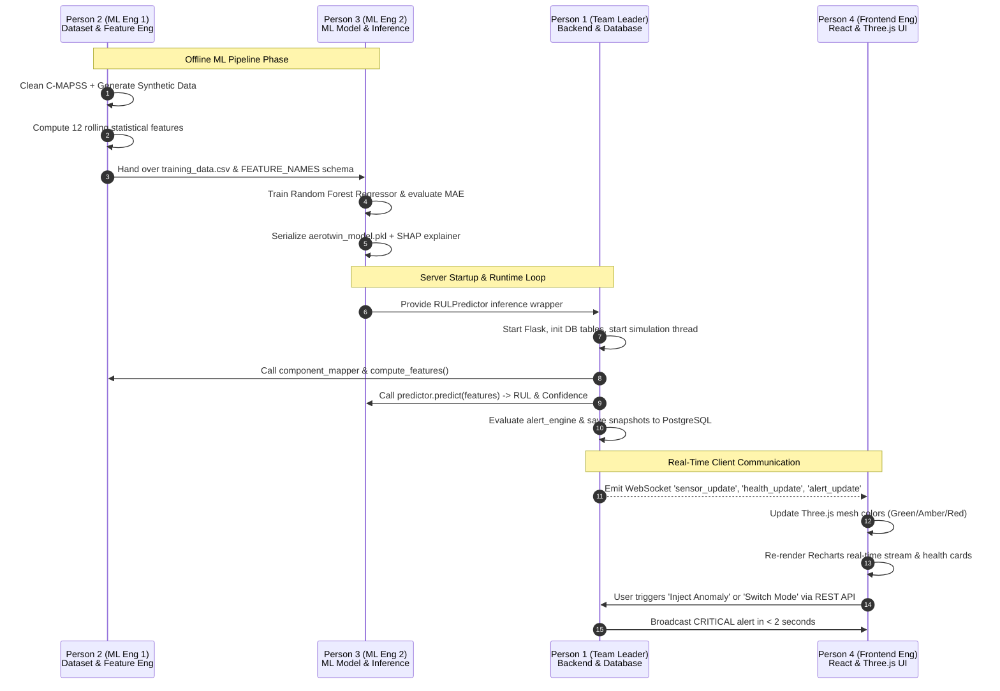

# ✈ AeroTwin — Project Work Allocation & Architecture Explanation

> **Real-Time Digital Twin for Predictive Aircraft Engine Health Monitoring**  
> **Repository:** AeroTwin (Team FELONS / Aerospace Track)  
> **Team Size:** 4 Members (1 Team Leader + 2 ML Engineers + 1 Frontend/3D Engineer)

---

## 📌 Executive Summary & Allocation Policy

This document defines the **work distribution, module ownership, integration contracts, and presentation guidelines** for the **AeroTwin** codebase among **4 team members**.

### Key Allocation Rules Followed:
1. **Team Leader (Person 1):** Assigned extra structural workload (Backend core architecture, real-time WebSocket orchestration, PostgreSQL database, simulation pipeline, REST APIs, testing suites, DevOps, and project management) — **strictly zero Machine Learning tasks**.
2. **Machine Learning Division (2 People — Person 2 & Person 3):** All data engineering, dataset preprocessing, synthetic telemetry generation, rolling-window feature engineering, Random Forest training, evaluation, SHAP explainability, and inference wrappers are divided between two dedicated ML engineers.
3. **Frontend & 3D Specialist (Person 4):** Responsible for the React 18 interface, Three.js 3D engine mesh visualization, interactive telemetry charts, modals, and real-time Socket.IO UI updates.

---

## 👥 Team Roles & Responsibilities Matrix

```
┌─────────────────────────────────────────────────────────────────────────────────────────┐
│                                 AEROTWIN TEAM ROLES                                     │
├────────────────────────┬────────────────────────┬───────────────────────┬───────────────┤
│ Person 1 (Team Leader) │ Person 2 (ML Eng 1)    │ Person 3 (ML Eng 2)   │ Person 4      │
│ Backend, DB & DevOps   │ Data & Feature Eng     │ Models & Inference    │ Frontend & 3D │
├────────────────────────┼────────────────────────┼───────────────────────┼───────────────┤
│ • Flask Core & Routes  │ • NASA C-MAPSS Clean   │ • Random Forest RUL   │ • React App   │
│ • PostgreSQL Database  │ • Synthetic Generator  │ • Hyperparameter Tune │ • Three.js 3D │
│ • WebSocket Server     │ • Feature Engineering  │ • Model Evaluation    │ • Recharts    │
│ • Physics Simulation   │ • Sensor Mapping       │ • SHAP Explainability │ • UI Modals   │
│ • Alert & Anomaly Logic│ • Time-Series Windows  │ • Inference Wrapper   │ • Cyberpunk   │
│ • Tests & System Integ │ • Data Validation      │ • Heuristic Fallback  │   Theme & CSS │
└────────────────────────┴────────────────────────┴───────────────────────┴───────────────┘
```

---

## 👤 Detailed Breakdown Per Member

---

### 1. Person 1: Team Leader — Backend Core, Database, Real-Time Architecture & DevOps
*Strictly Non-ML Responsibilities (Heavyweight Engineering & Management)*

#### Core Focus:
Architecting the Flask application, managing database transactions, coordinating real-time WebSocket events, implementing physics fatigue calculations and synthetic data simulation loops, building automated test suites, and orchestrating full-system integration.

#### Detailed Responsibilities:
1. **Application Core & Infrastructure:**
   - Manage the main Flask entry point ([`server/app.py`](file:///d:/Aerotwin/Aero-Twin/server/app.py)), thread lifecycle, CORS policies, environment configurations (`.env`), and background task threads.
   - Build and maintain the 7 REST API endpoints in [`server/routes.py`](file:///d:/Aerotwin/Aero-Twin/server/routes.py) (session management, telemetry queries, alert history, mode switching, fault injection).
   - Implement payload validation and sanitization in [`server/sanitize.py`](file:///d:/Aerotwin/Aero-Twin/server/sanitize.py).
2. **PostgreSQL Database Engineering:**
   - Design table schemas in [`server/db.py`](file:///d:/Aerotwin/Aero-Twin/server/db.py) (`sensor_readings`, `health_snapshots`, `maintenance_log`).
   - Implement high-throughput batch insertion, connection pooling (`psycopg2_pool`), and transaction rollback logic in [`server/db_writer.py`](file:///d:/Aerotwin/Aero-Twin/server/db_writer.py).
3. **Real-Time Data Streaming & WebSocket Engine:**
   - Configure Flask-SocketIO event handlers in [`server/socketio_server.py`](file:///d:/Aerotwin/Aero-Twin/server/socketio_server.py) (`sensor_update`, `health_update`, `alert_update`).
   - Manage the sub-second streaming loop that broadcasts data to all connected clients.
4. **Data Generation & Replay Pipeline:**
   - Implement the Mode B live physics generator in [`server/simulator.py`](file:///d:/Aerotwin/Aero-Twin/server/simulator.py).
   - Implement the Mode A CSV row-by-row replay engine in [`server/csv_reader.py`](file:///d:/Aerotwin/Aero-Twin/server/csv_reader.py).
5. **Physics & Alert Engine:**
   - Implement multi-factor fatigue accumulation algorithms in [`server/fatigue_engine.py`](file:///d:/Aerotwin/Aero-Twin/server/fatigue_engine.py).
   - Implement multi-tier anomaly detection and z-score alert triggering in [`server/alert_engine.py`](file:///d:/Aerotwin/Aero-Twin/server/alert_engine.py).
6. **DevOps, Testing & Project Coordination:**
   - Build unit and integration tests in [`server/tests/`](file:///d:/Aerotwin/Aero-Twin/server/tests).
   - Maintain `docker-compose.yml`, dependency management (`requirements.txt`), project milestone tracking, and cross-team interface alignment.

#### Primary Files Owned:
- [`server/app.py`](file:///d:/Aerotwin/Aero-Twin/server/app.py)
- [`server/routes.py`](file:///d:/Aerotwin/Aero-Twin/server/routes.py)
- [`server/socketio_server.py`](file:///d:/Aerotwin/Aero-Twin/server/socketio_server.py)
- [`server/db.py`](file:///d:/Aerotwin/Aero-Twin/server/db.py)
- [`server/db_writer.py`](file:///d:/Aerotwin/Aero-Twin/server/db_writer.py)
- [`server/simulator.py`](file:///d:/Aerotwin/Aero-Twin/server/simulator.py)
- [`server/csv_reader.py`](file:///d:/Aerotwin/Aero-Twin/server/csv_reader.py)
- [`server/fatigue_engine.py`](file:///d:/Aerotwin/Aero-Twin/server/fatigue_engine.py)
- [`server/alert_engine.py`](file:///d:/Aerotwin/Aero-Twin/server/alert_engine.py)
- [`server/sanitize.py`](file:///d:/Aerotwin/Aero-Twin/server/sanitize.py)
- [`docker-compose.yml`](file:///d:/Aerotwin/Aero-Twin/docker-compose.yml) & test suites

---

### 2. Person 2: ML Engineer 1 — Data Engineering, Preprocessing & Feature Extraction
*Machine Learning Division — Part A (Data Foundation & Feature Engineering)*

#### Core Focus:
Data ingestion, cleaning, normalization, transformation of the NASA C-MAPSS dataset, synthetic telemetry dataset generation, and mathematical feature extraction from streaming time-series windows.

#### Detailed Responsibilities:
1. **NASA C-MAPSS Dataset Ingestion & Preprocessing:**
   - Develop [`ml/preprocess_cmapss.py`](file:///d:/Aerotwin/Aero-Twin/ml/preprocess_cmapss.py) to parse raw space-separated text files (`FD001` through `FD004`).
   - Clean noisy channels, remove flat/invariant sensors (s1, s5, s6, s10, s16, s18, s19), and normalize operational settings.
   - Calculate exact piecewise ground-truth Remaining Useful Life (RUL) labels per flight cycle.
2. **Component Mapping Architecture:**
   - Map 21 raw sensor channels to the 3 monitored turbofan engine subsystems in [`server/component_mapper.py`](file:///d:/Aerotwin/Aero-Twin/server/component_mapper.py):
     - **Turbine Blade:** `s3` (LPT outlet temp), `s4` (HPT outlet temp), `s20` (HPT coolant bleed).
     - **Bearing:** `s8` (HPC speed), `s9` (LPT speed), `s13` (core speed), `s14` (fan speed).
     - **Compressor:** `s2` (inlet pressure), `s7` (HPC outlet pressure), `s11` (static pressure), `s17` (enthalpy).
3. **Synthetic Dataset Generation:**
   - Develop [`ml/generate_synthetic.py`](file:///d:/Aerotwin/Aero-Twin/ml/generate_synthetic.py) to create realistic, physics-grounded engine degradation trajectories (10,000+ flight cycle samples) with customizable noise, drift, and fault modes.
4. **Time-Series Feature Engineering:**
   - Implement the rolling-window feature computer in [`server/feature_engineer.py`](file:///d:/Aerotwin/Aero-Twin/server/feature_engineer.py).
   - Extract the 12 key ML features from the rolling 10-cycle window:
     - Mean values per component
     - Rolling variances & rates of change
     - Normalized thermal stress & pressure ratio indices
   - Validate feature distributions and eliminate collinearities or NaN/infinite values.

#### Primary Files Owned:
- [`ml/preprocess_cmapss.py`](file:///d:/Aerotwin/Aero-Twin/ml/preprocess_cmapss.py)
- [`ml/generate_synthetic.py`](file:///d:/Aerotwin/Aero-Twin/ml/generate_synthetic.py)
- [`server/feature_engineer.py`](file:///d:/Aerotwin/Aero-Twin/server/feature_engineer.py)
- [`server/component_mapper.py`](file:///d:/Aerotwin/Aero-Twin/server/component_mapper.py)
- Data validation scripts & datasets (`Data/`, `ml/training_data.csv`, `ml/synthetic_data.csv`)

---

### 3. Person 3: ML Engineer 2 — Model Training, Evaluation, Explainability & Inference Wrapper
*Machine Learning Division — Part B (Modeling, Evaluation & Inference)*

#### Core Focus:
Model architecture selection, training pipelines, hyperparameter optimization, error analysis (MAE/RMSE/R²), model explainability with SHAP, and the real-time inference wrapper module.

#### Detailed Responsibilities:
1. **Model Architecture & Training Pipeline:**
   - Build [`ml/train_model.py`](file:///d:/Aerotwin/Aero-Twin/ml/train_model.py) using `scikit-learn` Random Forest Regressor.
   - Blend real NASA C-MAPSS data (70%) with synthetic engine scenarios (30%) to improve generalization under unseen operating conditions.
   - Optimize hyperparameters (`n_estimators=100`, `max_depth=12`, `min_samples_split=5`).
2. **Model Evaluation & Metrics:**
   - Evaluate model on held-out test splits (20% holdout).
   - Benchmark performance metrics: Target MAE ~12-18 flight hours, RMSE, and R² score (>0.85).
   - Compute feature importance rankings to verify physical validity of model decisions.
3. **Model Packaging & Serialization:**
   - Serialize trained model binaries using `joblib` (`ml/aerotwin_model.pkl`).
   - Implement model versioning and backward compatibility checks.
4. **Real-Time Inference Engine & Fallback:**
   - Develop [`server/ml_model.py`](file:///d:/Aerotwin/Aero-Twin/server/ml_model.py) `RULPredictor` class.
   - Provide sub-second inference (`predict(features) -> predicted_rul, confidence, importance`).
   - Implement graceful heuristic fallback estimation when ML artifacts are loading or missing.
5. **Explainable AI (XAI) & SHAP Integration:**
   - Integrate `shap.TreeExplainer` in [`server/ml_model.py`](file:///d:/Aerotwin/Aero-Twin/server/ml_model.py) to output real-time sensor attribution scores for anomalies.

#### Primary Files Owned:
- [`ml/train_model.py`](file:///d:/Aerotwin/Aero-Twin/ml/train_model.py)
- [`ml/aerotwin_model.pkl`](file:///d:/Aerotwin/Aero-Twin/ml/aerotwin_model.pkl)
- [`server/ml_model.py`](file:///d:/Aerotwin/Aero-Twin/server/ml_model.py)
- Model benchmarking reports, SHAP analysis scripts, and evaluation logs

---

### 4. Person 4: Frontend & 3D Visualization Engineer — React, Three.js & Cyberpunk UI
*User Experience, 3D Graphics & Client-Side State Management*

#### Core Focus:
Building the interactive, cyberpunk-themed React 18 dashboard, rendering the 3D turbofan engine model with Three.js/WebGL, handling live WebSocket streaming, and developing diagnostic modal views.

#### Detailed Responsibilities:
1. **3D Jet Engine Digital Twin Visualization:**
   - Develop [`client/src/components/EngineModel.jsx`](file:///d:/Aerotwin/Aero-Twin/client/src/components/EngineModel.jsx) using Three.js.
   - Load and render 3D GLTF turbofan model with orbit controls, lighting, and camera animations.
   - Dynamically change component mesh material colors and emissive glows based on real-time health (Emerald Green `>80%`, Amber `60-80%`, Red `<60%`, Pulsing Critical Beacon `<40%`).
2. **Interactive Telemetry Visualizations & Charts:**
   - Build dual-axis area charts and trend graphs using Recharts in [`client/src/components/TemperatureAreaChart.jsx`](file:///d:/Aerotwin/Aero-Twin/client/src/components/TemperatureAreaChart.jsx) and [`client/src/components/FatigueLineChart.jsx`](file:///d:/Aerotwin/Aero-Twin/client/src/components/FatigueLineChart.jsx).
   - Implement rolling 200-point buffer for real-time sensor streaming without UI frame drops.
   - Build the 6-sensor card grid in [`client/src/components/TelemetryGrid.jsx`](file:///d:/Aerotwin/Aero-Twin/client/src/components/TelemetryGrid.jsx).
3. **Subsystem Health Cards & Metrics:**
   - Build [`client/src/components/ComponentHealthCard.jsx`](file:///d:/Aerotwin/Aero-Twin/client/src/components/ComponentHealthCard.jsx) and [`client/src/components/AnimatedCounter.jsx`](file:///d:/Aerotwin/Aero-Twin/client/src/components/AnimatedCounter.jsx) for Turbine, Bearing, and Compressor status indicators.
4. **Alerts & Diagnostics Panels:**
   - Build the real-time notification feed in [`client/src/components/AlertPanel.jsx`](file:///d:/Aerotwin/Aero-Twin/client/src/components/AlertPanel.jsx) with severity badges (Nominal, Warning, Degraded, Critical).
   - Build [`client/src/components/SystemDiagnostics.jsx`](file:///d:/Aerotwin/Aero-Twin/client/src/components/SystemDiagnostics.jsx) for system health, latency, and throughput counters.
5. **Interactive Modals & Mode Controller UI:**
   - Develop [`client/src/components/ModeToggle.jsx`](file:///d:/Aerotwin/Aero-Twin/client/src/components/ModeToggle.jsx) (Instant switch between Mode A NASA CSV and Mode B Live Simulation).
   - Develop [`client/src/components/EngineExpandModal.jsx`](file:///d:/Aerotwin/Aero-Twin/client/src/components/EngineExpandModal.jsx), [`client/src/components/ComponentDetailModal.jsx`](file:///d:/Aerotwin/Aero-Twin/client/src/components/ComponentDetailModal.jsx), and [`client/src/components/CSVUploadModal.jsx`](file:///d:/Aerotwin/Aero-Twin/client/src/components/CSVUploadModal.jsx).
6. **Styling & Responsive Design:**
   - Create and refine dark-mode glassmorphic aesthetics in [`client/src/index.css`](file:///d:/Aerotwin/Aero-Twin/client/src/index.css) and [`client/tailwind.config.js`](file:///d:/Aerotwin/Aero-Twin/client/tailwind.config.js).

#### Primary Files Owned:
- [`client/src/App.jsx`](file:///d:/Aerotwin/Aero-Twin/client/src/App.jsx)
- [`client/src/components/EngineModel.jsx`](file:///d:/Aerotwin/Aero-Twin/client/src/components/EngineModel.jsx)
- [`client/src/components/EngineExpandModal.jsx`](file:///d:/Aerotwin/Aero-Twin/client/src/components/EngineExpandModal.jsx)
- [`client/src/components/ComponentHealthCard.jsx`](file:///d:/Aerotwin/Aero-Twin/client/src/components/ComponentHealthCard.jsx)
- [`client/src/components/ComponentDetailModal.jsx`](file:///d:/Aerotwin/Aero-Twin/client/src/components/ComponentDetailModal.jsx)
- [`client/src/components/TemperatureAreaChart.jsx`](file:///d:/Aerotwin/Aero-Twin/client/src/components/TemperatureAreaChart.jsx)
- [`client/src/components/FatigueLineChart.jsx`](file:///d:/Aerotwin/Aero-Twin/client/src/components/FatigueLineChart.jsx)
- [`client/src/components/TelemetryGrid.jsx`](file:///d:/Aerotwin/Aero-Twin/client/src/components/TelemetryGrid.jsx)
- [`client/src/components/AlertPanel.jsx`](file:///d:/Aerotwin/Aero-Twin/client/src/components/AlertPanel.jsx)
- [`client/src/components/ModeToggle.jsx`](file:///d:/Aerotwin/Aero-Twin/client/src/components/ModeToggle.jsx)
- [`client/src/components/CSVUploadModal.jsx`](file:///d:/Aerotwin/Aero-Twin/client/src/components/CSVUploadModal.jsx)
- [`client/src/components/SystemDiagnostics.jsx`](file:///d:/Aerotwin/Aero-Twin/client/src/components/SystemDiagnostics.jsx)
- [`client/src/components/AnimatedCounter.jsx`](file:///d:/Aerotwin/Aero-Twin/client/src/components/AnimatedCounter.jsx)
- [`client/src/index.css`](file:///d:/Aerotwin/Aero-Twin/client/src/index.css)

---

## 🔄 End-to-End System Pipeline & Inter-Member Handoffs



---

## 📊 Summary Responsibility Matrix

| Feature / Component | Person 1 (Team Leader) | Person 2 (ML Eng 1) | Person 3 (ML Eng 2) | Person 4 (Frontend) |
|---|:---:|:---:|:---:|:---:|
| **Flask Server Core & Routes** | Primary | - | - | - |
| **PostgreSQL Database & ORM** | Primary | - | - | - |
| **WebSocket Streaming (Socket.IO)** | Primary | - | - | Consumer |
| **Physics Simulation & Fatigue** | Primary | Contributor | - | - |
| **Alert Engine & Thresholds** | Primary | - | Contributor | - |
| **Testing, Docker & Project Lead** | Primary | - | - | - |
| **NASA C-MAPSS Preprocessing** | - | Primary | - | - |
| **Synthetic Dataset Generation** | - | Primary | - | - |
| **Rolling Feature Extraction** | - | Primary | Reviewer | - |
| **21-Sensor Component Mapper** | - | Primary | - | - |
| **Random Forest Model Training** | - | - | Primary | - |
| **Model Evaluation (MAE/RMSE/R²)** | - | Contributor | Primary | - |
| **SHAP Explainability & Metrics** | - | - | Primary | - |
| **Inference Wrapper (`ml_model.py`)** | - | - | Primary | - |
| **Three.js 3D Engine Visualization** | - | - | - | Primary |
| **React 18 Dashboard & Navigation** | - | - | - | Primary |
| **Live Recharts Telemetry Charts** | - | - | - | Primary |
| **Diagnostics & Modal Popups** | - | - | - | Primary |
| **Cyberpunk Styling & Tailwind CSS** | - | - | - | Primary |

---

## 🎤 Viva & Project Presentation Speaking Guide

### Person 1: Team Leader
- **What to present:** Project architecture, why digital twins matter in aviation, real-time backend pipeline, PostgreSQL schema optimization, WebSocket low-latency event loop (<100ms), and fault injection flow.
- **Key question to answer:** *"How does the system ensure zero lag between data generation and frontend updates?"*
  - *Answer:* "We use eventlet-based async Socket.IO broadcasting connected directly to the background simulation loop, pushing delta packets every 2 seconds without HTTP polling overhead."

### Person 2: ML Engineer 1
- **What to present:** NASA C-MAPSS dataset structure (FD003/FD004), sensor channel selection, physics-informed synthetic telemetry generation, and rolling 10-window feature engineering (mean, variance, rate of change, thermal stress).
- **Key question to answer:** *"Why did you discard 7 out of the 21 NASA sensor channels?"*
  - *Answer:* "Sensors s1, s5, s6, s10, s16, s18, and s19 showed near-zero variance across operating regimes in C-MAPSS, representing constants. Removing them prevented model overfitting and reduced feature computation latency."

### Person 3: ML Engineer 2
- **What to present:** Random Forest regression design, train-test splitting strategy, hyperparameter tuning, model accuracy metrics (MAE of ~12-18 flight hours), and SHAP attribution for explainable maintenance diagnostics.
- **Key question to answer:** *"Why Random Forest instead of deep learning (LSTM/CNN) for RUL prediction?"*
  - *Answer:* "Random Forest provides high sample efficiency, handles tabular statistical features with low training footprint, is immune to exploding gradients, and crucially allows real-time TreeExplainer SHAP feature attribution for auditable aerospace compliance."

### Person 4: Frontend & 3D Visualization Engineer
- **What to present:** Three.js GLTF model integration, health-reactive shader/color interpolation, 60fps chart rendering with rolling buffers, and user-experience design for rapid anomaly identification.
- **Key question to answer:** *"How does the 3D model reflect real-time subsystem degradation?"*
  - *Answer:* "Three.js traverses the mesh hierarchy targeting turbine, bearing, and compressor nodes, dynamically mapping health scores (0-100%) to RGB color lerping (emerald green -> amber -> crimson red) with pulsating emissive warning highlights during critical alerts."

---
*Document prepared for AeroTwin Development Team.*
